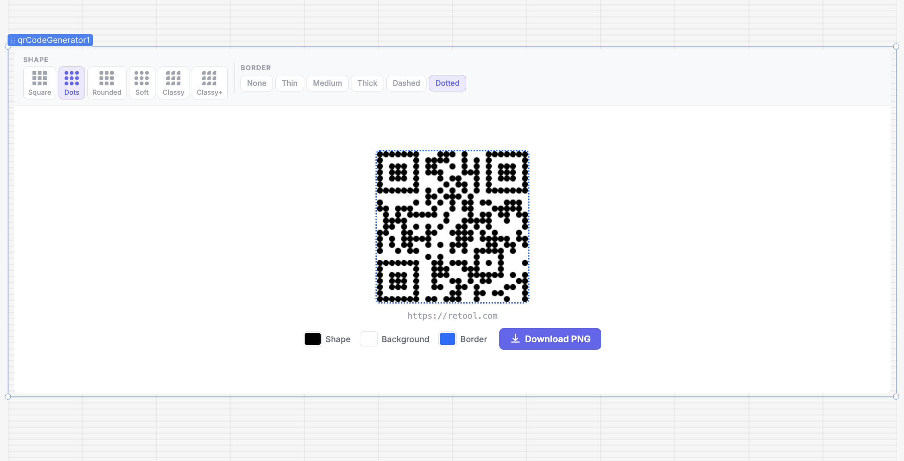

# QR Code Generator

A Retool Custom Component that generates styled QR codes with live customization controls built directly into the component. Choose from 6 dot shapes, set border styles, pick colors for shapes and background, embed a logo, and download the result as a PNG — all without leaving the canvas.

## Features

- 6 dot shape styles: Square, Dots, Rounded, Soft, Classy, and Classy+
- Border options: None, Thin, Medium, Thick, Dashed, and Dotted
- Shape and background color pickers built into the component
- Optional logo/image embedded in the center of the QR code
- Configurable error correction level (L / M / Q / H)
- One-click PNG download
- QR image exposed as a base64 Data URL — connect to an Image component or save to a database
- Fires a `download` event on PNG export — wire to any downstream query
- Fully responsive — scales to fit its container without overlapping controls

## Installation

1. In your Retool app, open the **Component** panel and add a **Custom Component**
2. Import this component from the repository
3. Set the **Value** field in the inspector to the URL or text you want to encode
4. Optionally set a **Title**, adjust **Size**, or embed a **Logo URL**

## Properties

| Property | Type | Description |
|---|---|---|
| `value` | string | Text or URL to encode in the QR code |
| `title` | string | Optional label shown below the QR code |
| `size` | number | Width and height of the QR code in pixels (default 200) |
| `fgColor` | string | Color of the QR code dots/shapes (hex) |
| `bgColor` | string | Color of the light squares inside the QR code (hex) |
| `dotShape` | enumeration | Dot style: `square`, `dots`, `rounded`, `extra-rounded`, `classy`, `classy-rounded` |
| `borderStyle` | enumeration | Border around the QR code: `none`, `thin`, `medium`, `thick`, `dashed`, `dotted` |
| `borderColor` | string | Color of the border (hex) |
| `logoUrl` | string | Optional image URL to embed in the center of the QR code |
| `logoSize` | number | Logo width as a percentage of QR code size (5–30, default 20) |
| `errorLevel` | string | Error correction level: `L` (7%), `M` (15%), `Q` (25%), `H` (30%). Use `H` when embedding a logo |
| `dataUrl` | string | The QR code as a base64 PNG — use with an Image component or to save to a database |

## Events

| Event | Description |
|---|---|
| `download` | Fires when the user clicks **Download PNG** |

## Usage

### Basic setup

Set the **Value** inspector field to the URL or text you want to encode. The QR code renders immediately. Use the shape and border selectors inside the component to style it without touching the inspector.

### Embedding a logo

Set **Logo URL** to any publicly accessible image URL. Increase **Error correction** to `H` (30%) so the QR remains scannable even with a logo covering part of it. Use **Logo size** to control how much of the QR the logo covers (5–30%).

### Capturing the QR as an image

The `dataUrl` output property contains the QR code as a base64-encoded PNG. Connect it to a Retool Image component's **Image source** field to display it elsewhere, or pass it to a query to save it to a database or storage bucket.

### Wiring the download event

Connect the `download` event to a query if you want to log, track, or trigger an action whenever a user exports the QR code.

## Ideal Use Cases

- Marketing and campaign dashboards — generate QR codes for URLs, coupons, or landing pages
- Product and inventory management — encode SKUs, barcodes, or asset IDs
- Event management — generate QR codes for tickets or check-in links
- Customer-facing tools — let users create branded QR codes with a logo
- Any workflow that needs a scannable code generated on the fly

## Author

Created by [@angelikretool](https://github.com/angelikretool) for the Retool community.
